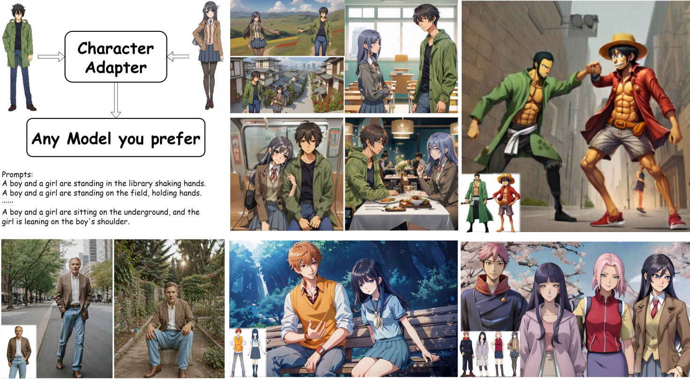
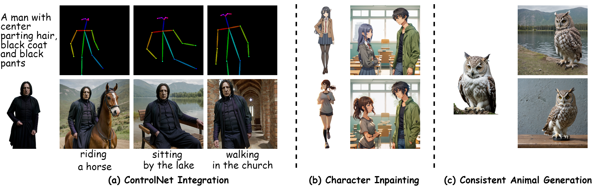

<h1>Character-Adapter: Prompt-Guided Region Control for High-Fidelity Character Customization</h1>

[**Yuhang Ma**](https://yuhang-ma.github.io/)<sup>1</sup> · Wenting Xu<sup>1</sup> · Jiji Tang<sup>1</sup> · Qinfeng Jin<sup>1</sup> · Rongsheng Zhang<sup>1</sup> · Zeng Zhao<sup>1</sup> · Bai Liu<sup>1</sup> · Changjie Fan<sup>1</sup> · Zhipeng Hu<sup>1</sup>


<sup>1</sup>Fuxi AI Lab, NetEase Inc.

<a href='https://character-adapter.github.io/'></a>
<a href='https://arxiv.org/abs/2406.16537'></a>

</div>

Character-Adapter empowers the customization of concepts while preserving the high-fidelity appearance of given characters (without any quantitative limitations), encompassing attributes such as hairstyle, identity, attire, and others without extra training.



## Updates
- [2024/06/25] Code is coming soon.
- [2024/06/25] 🔥 We release the [paper](https://arxiv.org/abs/2406.16537) and the [project page](https://character-adapter.github.io/).


## Visualization
Character-Adapter is designed to generate highly consistent characters with intricate details. Its advantage of not necessitating further training allows it to be more versatile and practical in its applications. This can generate not just characters, but also objects in other domains.

### Customize Your Character/Characters to Anywhere

<p align="center">
  
</p>

### Transfer Your Character/Characters into Any Style

<p align="center">
  
</p>

### Extended Application


<p align="center">
  
</p>

## Comparison with Previous Works
Compared with other methods, including both fine-tuned and training-free methods, Character-Adapter generates high-fidelity multi-character images with intricate details while preserving text-image alignment. 

<p align="center">
  
</p>


## Acknowledgements
- Character-Adapter is developed by Fuxi AI Lab, NetEase Inc.
- Inspired by [IP-Adapter](https://github.com/tencent-ailab/IP-Adapter), [DAAM](https://github.com/castorini/daam) and [ControlNet](https://github.com/lllyasviel/ControlNet). Thanks for their great works!


## Cite
If you find Character-Adapter useful for your research and applications, please cite us using this BibTeX:

```bibtex
@misc{ma2024characteradapter,
      title={Character-Adapter: Prompt-Guided Region Control for High-Fidelity Character Customization}, 
      author={Yuhang Ma and Wenting Xu and Jiji Tang and Qinfeng Jin and Rongsheng Zhang and Zeng Zhao and Changjie Fan and Zhipeng Hu},
      year={2024},
      eprint={2406.16537},
      archivePrefix={arXiv},
      primaryClass={id='cs.CV' full_name='Computer Vision and Pattern Recognition' is_active=True alt_name=None in_archive='cs' is_general=False description='Covers image processing, computer vision, pattern recognition, and scene understanding. Roughly includes material in ACM Subject Classes I.2.10, I.4, and I.5.'}
}
```

For any question, please feel free to contact us via mayuhang@corp.netease.com
